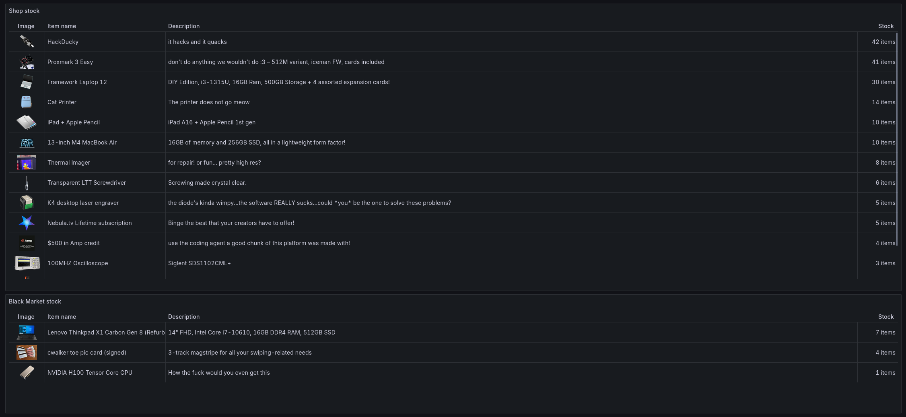

# Summer of Making Monitor

Stock tracking for the Summer of Making shop using Prometheus metrics.

Uses the [SoM Monitor API](https://github.com/SkyfallWasTaken/som-monitor) by Skyfall for shop data <3

## Online demo

[][1]

**[🌍 View dashboard on grafana.slevel.xyz][1]**

[1]: TODO <!-- Add demo link here -->

## Local development

This project uses Python (3.9+) and [uv](https://docs.astral.sh/uv/) for development.

1. Clone the repo
2. `uv run main.py`
3. Head to <http://localhost:9040/metrics> to see the metrics

## Production deployment with Docker Compose

1. Download the example Compose file from [deployment/docker-compose.yml](deployment/docker-compose.yml). Feel free to adjust it to your needs.
2. Start it with `docker-compose up -d`
3. Metrics should now be available at <http://localhost:9040/metrics>

### Example `prometheus.yml` config

Start tracking the metrics by adding Daydream Watcher as a scrape config to a Prometheus-compatible database (e.g. Prometheus, VictoriaMetrics).

```yaml
scrape_configs:
  - job_name: som-watcher
    scrape_interval: "10s"
    static_configs:
      - targets: ["som-watcher:9040"]
```

<!-- ### Example Grafana dashboard

Start visualising the metrics by importing the example Grafana dashboard at [deployment/grafana-dashboard.json](deployment/grafana-dashboard.json) into your Grafana instance. -->

## Maintainers: Releasing a new version

Use the `release-new-version.sh` shell script, e.g.

```bash
./release-new-version.sh 0.2.1
```

It will

1. Bump the version in `pyproject.toml`
2. Create and push a Git tag for the new version
3. Build and publish the Docker image to Docker Hub

Then, manually check that the version bump commit is as expected, and `git push` it.
